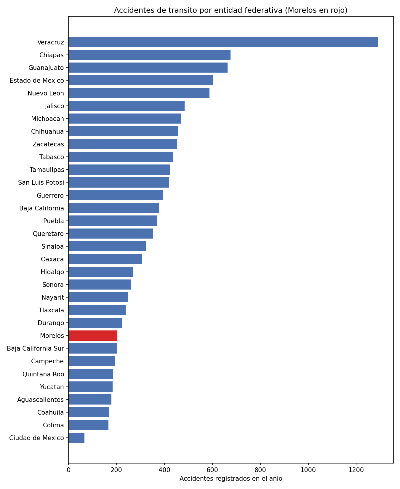
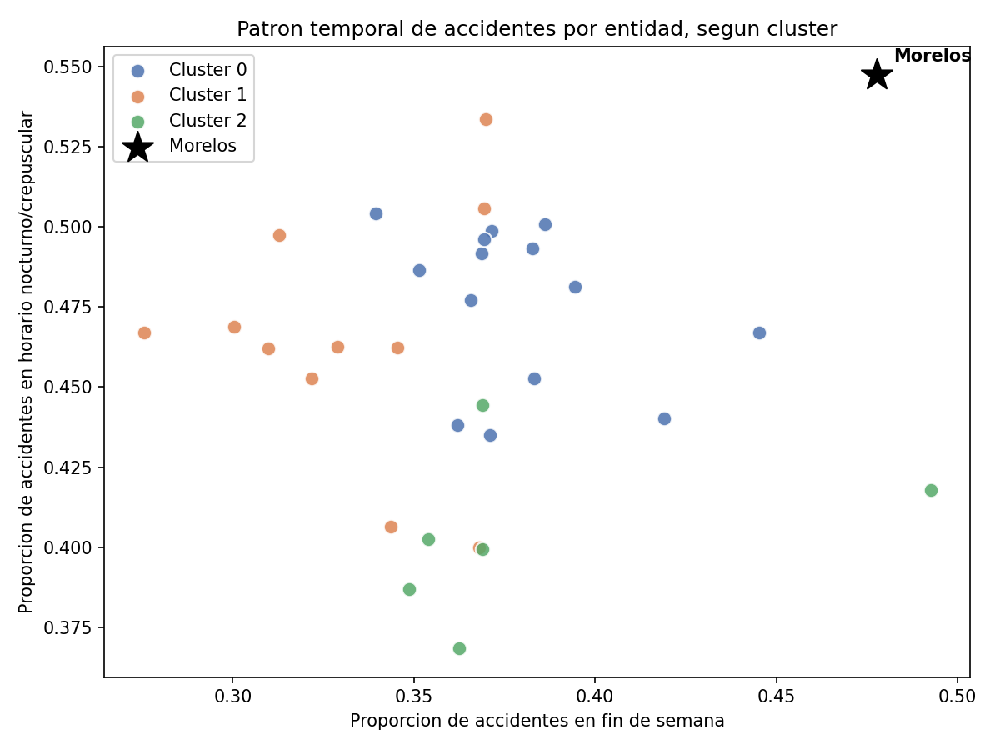

# Segmentación de entidades federativas de México según patrones de accidentes de tránsito: el caso de Morelos

## Integrantes
- Ruiz Santos Orlando
- Ventura Gil Astrid Valeria
- Ocampo Martínez Angel Daniel
- Medina Villa Abril Aidee

## Grupo
9° A

## Materia
Extracción de conocimiento de Bases de Datos

## Tema asignado
Tema 4 — Análisis de movilidad, transporte o accidentes con datos públicos.

## Pregunta guía
¿Qué patrones aparecen en los datos de accidentes de tránsito en México, y en qué grupo se ubica Morelos en comparación con las demás entidades federativas?

## Fuente de datos
- **Institución:** Secretaría de Infraestructura, Comunicaciones y Transportes (SICT).
- **Portal:** Portal de Datos Abiertos de México — [datos.gob.mx](https://www.datos.gob.mx/dataset/accidentes_transito)
- **Licencia:** Creative Commons Attribution 4.0 (CC-BY-4.0).
- Detalle completo de los recursos usados, URLs de descarga directa y notas sobre cobertura temporal/geográfica en [`referencias/fuentes_datos.txt`](referencias/fuentes_datos.txt).

## Descripción breve del dataset
Dos archivos CSV oficiales, agregados por entidad federativa (32 entidades):
1. Accidentes por día de la semana y por condición de luz (día, crepúsculo, noche, alumbrado público), separados en totales y accidentes mortales.
2. Accidentes por mes, con número de heridos, muertos y daños materiales estimados.

A partir de ambos se construyó un dataset limpio de 32 filas (una por entidad) con variables de tasa y proporción: tasa de letalidad, tasa de heridos, proporción de accidentes en fin de semana y proporción de accidentes en horario nocturno/crepuscular.

## Técnicas usadas
- Limpieza de datos (separación de tipos de registro, homologación de nombres de entidades, verificación de nulos/duplicados).
- Construcción de variables derivadas (tasas y proporciones) para hacer comparable a entidades de distinto tamaño.
- Análisis exploratorio de datos (EDA): estadísticas descriptivas, comparación contra promedio nacional, gráficas.
- Modelo no supervisado **KMeans** (con estandarización previa vía `StandardScaler` y selección de *k* mediante coeficiente de silueta).

## Principales resultados
- Morelos se ubica en una posición intermedia-baja en volumen total de accidentes (lugar 24 de 32).
- Morelos tiene una de las tasas de letalidad más bajas del país (~11.4 muertos por cada 100 accidentes, vs. un promedio nacional de ~24.6).
- Morelos presenta la proporción más alta de accidentes en horario nocturno/crepuscular de las 32 entidades (~54.7%) y la segunda proporción más alta de accidentes en fin de semana (~47.8%).
- El modelo KMeans (k=3) agrupa a Morelos con entidades de letalidad promedio más alta, pero el análisis detallado muestra que esa pertenencia al grupo se explica por el patrón temporal compartido, no por la letalidad.
- Detalle completo de la interpretación en [`articulo_tecnico.md`](articulo_tecnico.md).

## Gráficas principales

**Gráfica 1.** Accidentes totales por entidad federativa (Morelos resaltado en rojo).



**Gráfica 2.** Proporción de accidentes en fin de semana vs. horario nocturno/crepuscular, coloreada por cluster.



Ambas gráficas se generan con Python/matplotlib desde el notebook (ver `notebook/analisis_datos_publicos.ipynb`) y se guardan automáticamente en esta carpeta al ejecutarlo.

## Limitaciones
- Datos agregados a nivel de entidad federativa, no municipal.
- El periodo exacto de referencia de los datos no está explícito en los metadatos públicos del recurso.
- Muestra pequeña para el modelo (32 observaciones).
- Faltan variables como tipo de vehículo, tipo de vialidad o causa del accidente.
- El modelo no permite afirmar causalidad, solo asociación estadística.
- Ver sección completa de limitaciones en [`articulo_tecnico.md`](articulo_tecnico.md).

## Cómo ejecutar el notebook
1. Clonar o descargar este repositorio.
2. Crear un entorno con Python 3.10+ e instalar las dependencias:
   ```bash
   pip install pandas numpy matplotlib scikit-learn jupyter
   ```
3. Abrir `notebook/analisis_datos_publicos.ipynb` en Jupyter/Anaconda y ejecutar todas las celdas en orden (Kernel → Restart & Run All).
4. El notebook lee los archivos de `data/raw/`, genera `data/processed/dataset_limpio.csv`, las gráficas en `imagenes/` y los resultados en `outputs/`.

## Estructura del repositorio
```
proyecto-articulo-datos-publicos/
├── README.md
├── articulo_tecnico.md
├── notebook/
│   └── analisis_datos_publicos.ipynb
├── data/
│   ├── raw/
│   │   ├── sct_70_accidentes_dia.csv
│   │   └── sct_71_accidentes_mes.csv
│   └── processed/
│       └── dataset_limpio.csv
├── outputs/
│   ├── resultados_modelo.csv
│   └── resumen_resultados.csv
├── imagenes/
│   ├── grafica_1.png
│   └── grafica_2.png
└── referencias/
    └── fuentes_datos.txt
```

## Evidencia del proyecto
- **Artículo técnico completo:** [`articulo_tecnico.md`](articulo_tecnico.md) ([`articulo_tecnico.pdf`](articulo_tecnico.pdf))
- **Repositorio en GitHub:** https://github.com/RuuizOr/Analisis-de-movilidad-transporte-o-accidentes-con-datos-publicos
- **Publicación en Hashnode:** https://edu-blog-vn.hashnode.dev/segmentaci-n-de-accidentes-de-tr-nsito-en-m-xico-con-kmeans